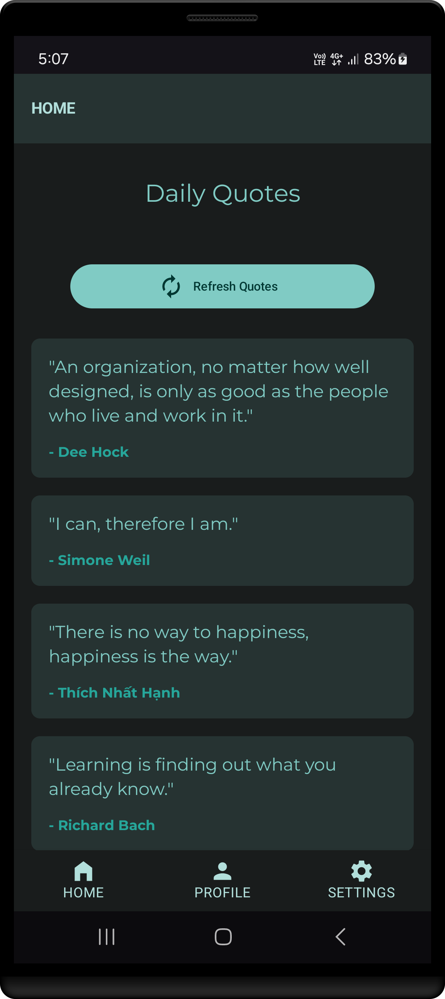
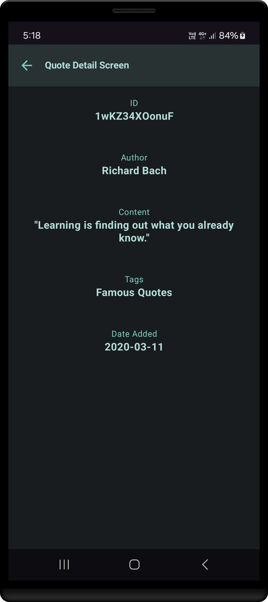

<h1 align="center" >
Modular MVI Architecture  <br> 
♨ [ ᴀɴᴅʀᴏɪᴅ  ᴘʀᴏᴊᴇᴄᴛ ] ♨
</h1>

⁃ ᴄᴏɴᴛᴇɴᴛꜱ ⁃
1. [Introduction](#introduction)
2. [Architecture Overview](#architecture-overview)
3. [Module Details](#module-details)
    - [App Module](#app-module)
    - [Core Module](#core-module)
    - [Data Module](#data-module)
    - [DI Module](#di-module)
    - [Domain Module](#domain-module)
    - [UI Module](#ui-module)
    - [Util Module](#util-module)
4. [Android Architecture Project Structure](#android-architecture-project-structure)
5. [Conclusion](#conclusion)

---

## Introduction

**Understanding MVI Architecture**  

This documentation provides an overview of a modular MVI architecture designed for Android applications. The architecture is organized into distinct modules that separate concerns, improve maintainability, and promote scalability. Each module has its own responsibilities, from handling UI state to managing data sources and dependency injection.

---

### **What Makes MVI Special?**
- **It’s like MVVM’s upgraded sibling**: While MVVM is popular, MVI adds stricter rules for managing UI states and user actions.
- **Unidirectional flow**: Data moves in one direction (User → Intent → Model → View), reducing bugs and surprises.

---

### **Key Components of MVI**
Here’s how the pieces fit together:

1. **Model (The Truth Source)**
    - Represents the **current state of the UI** (e.g., “Loading,” “Error,” “Data Loaded”).
    - Defined in files like `UiState.kt/ViewState.kt` (general rules) and `HomeUiState.kt` (screen-specific states).
    - *Example*: A weather app’s state could be `WeatherState.Loading` or `WeatherState.Sunny(27°C)`.

2. **View (The Display)**
    - Screens like `HomeScreen.kt` that **show the UI** based on the current state.
    - *How it works*: Observes the Model and updates automatically, like a TV changing channels.

3. **Intent (User Actions)**
    - **What the user does** (e.g., clicking a button, typing).
    - Defined in files like `HomeIntent.kt`.
    - *Example*: A “Refresh” button click becomes `HomeIntent.RefreshWeather`.

4. **Side Effects (One-Time Events)**
    - Short-lived actions like showing an error message or navigating to a new screen.
    - Handled by `ViewSideEffect.kt` and screen-specific files like `HomeEffect.kt`.
    - *Why?* So you don’t show the same error twice after rotating the screen.

5. **ViewModel (The Brain)**
    - Processes intents, updates the state, and triggers side effects.
    - Uses `BaseViewModel.kt` for shared logic, while screens like `HomeViewModel.kt` add specifics.

---

### **How It Works in Code**
- **StateFlow**:
    - Tracks the UI state (e.g., `uiState`). Always has a value, like a live scoreboard.
    - *Used for*: Persistent states (e.g., a loaded list of items).

- **SharedFlow**:
    - Handles user events (intents). Drops events if nobody’s listening.
    - *Used for*: Actions like button clicks.

- **Channels**:
    - Manages one-time side effects (e.g., error messages).
    - *Used for*: “Fire and forget” events that shouldn’t repeat.

---

### **Project Structure Example**
```
├── core           # Shared core components
│   └── BaseViewModel.kt  
│
└── home           # A feature module (e.g., Home Screen)
    ├── HomeEffect.kt      # Side effects (e.g., navigation)
    ├── HomeIntent.kt      # User actions (e.g., button clicks)
    ├── HomeScreen.kt      # UI layout
    ├── HomeUiState.kt     # State (e.g., loading, data loaded)
    └── HomeViewModel.kt   # Logic for this screen
```

---

### **Why This Matters**
- **Predictable**: Data flows in one direction, like a waterfall.
- **Easy to debug**: Every action and state change is traceable.
- **Scalable**: Adding new features feels the same as building previous ones.


By organizing code this way, your app stays clean even as it grows like building with Lego blocks! 🧱

---

### **Current App Screens**

<div align="center">




</div>

---

## Architecture Overview

The project is divided into several modules, each responsible for a specific layer of the application:

- **App Module:** Entry point and application-level components.
- **Core Module:** Contains base classes and shared utilities for implementing the MVI pattern.
- **Data Module:** Manages data sources (both local and remote) and repository implementations.
- **DI Module:** Houses dependency injection components and modules.
- **Domain Module:** Contains business logic, domain models, repository interfaces, and use cases.
- **UI Module:** Handles user interface components, navigation, and theming.
- **Util Module:** Provides common utility functions and constants used across the application.

This separation allows each layer to evolve independently and facilitates testing, maintenance, and feature expansion.

---

## Module Details

### App Module

**Location:** `app`

**Files:**
- **MainActivity.kt:** The main activity that serves as the primary entry point for the app’s UI.
- **MainApplication.kt:** The application class that initializes global configurations, including dependency injection and application-wide resources.

**Purpose:**  
The App module sets up the application’s entry point and global configurations. It acts as the bridge between the Android system and the application’s modular components.

---

### Core Module

**Location:** `core`

**Files:**
- **BaseViewModel.kt:** A base ViewModel class that other ViewModels extend. It provides common functionality for managing UI state and handling intents.
- **Response.kt:** A generic response wrapper used for handling data responses, success, or error states.
- **UiState.kt:** Defines the base UI state used throughout the application to represent loading, success, or error states.
- **state (folder):** Contains the MVI-specific state definitions:
    - **ViewIntent.kt:** Represents user intents or actions.
    - **ViewSideEffect.kt:** Represents one-time events or side effects (e.g., navigation, toasts).
    - **ViewState.kt:** Represents the current state of the view.

**Purpose:**  
The Core module provides foundational classes and interfaces that are common to all features. It implements the MVI pattern by defining intents, states, and side effects, ensuring a consistent approach to UI state management.

---

### Data Module

**Location:** `data`

This module is responsible for data management, including local and remote data sources, and repository implementations.

#### Local Data

**Folder:** `data/local`

- **database (folder):**
    - **AppDatabase.kt:** Configures the Room database.
    - **dao/QuoteDao.kt:** Data Access Object (DAO) for database operations on quotes.
    - **entity/QuoteEntity.kt:** Database entity representing a quote.
    - **util/Converters.kt:** Contains type converters used by Room.

- **datasource/LocalDataSource.kt:** Provides methods for interacting with the local database.

- **datastore:**
    - **DataStoreKeys.kt:** Defines keys used for storing data.
    - **DataStoreRepository.kt & DataStoreRepositoryImpl.kt:** Interfaces and their implementation for handling DataStore operations.

#### Remote Data

**Folder:** `data/remote`

- **ApiConstants.kt:** Contains constants used for API endpoints and configurations.
- **QuoteApiService.kt:** Retrofit service interface defining API calls for fetching quotes.

#### Repository

**Folder:** `data/repository`

- **LocalDataRepositoryImpl.kt:** Implementation of the repository for local data operations.
- **QuoteRepositoryImpl.kt:** Implementation of the repository for handling remote data operations related to quotes.

**Purpose:**  
The Data module abstracts the details of data access, whether local or remote. It provides a unified interface for the rest of the application to retrieve, store, and manage data without concerning itself with the underlying data source.

---

### DI Module

**Location:** `di`

This module uses dependency injection to provide the necessary dependencies throughout the application.

#### Components

**Folder:** `di/components`
- **TrustManager.kt:** A component that likely handles SSL/TLS or network security aspects.

#### Modules

**Folder:** `di/module`
- **AppModule.kt:** Provides application-wide dependencies.
- **DatabaseModule.kt:** Provides database-related dependencies.
- **DataSourceModule.kt:** Provides data source-related dependencies.
- **DataStoreModule.kt:** Configures and provides DataStore dependencies.
- **DispatchersModule.kt:** Provides coroutine dispatchers for threading.
- **NetworkModule.kt:** Configures network-related dependencies (e.g., Retrofit, OkHttp).
- **RepositoryModule.kt:** Provides repository implementations.
- **UseCaseModule.kt:** Provides use case instances for the domain layer.

**Purpose:**  
The DI module centralizes the configuration of dependency injection, making it easier to manage, replace, or update dependencies without affecting other modules. It ensures that all components receive their dependencies in a consistent and testable manner.

---

### Domain Module

**Location:** `domain`

This module encapsulates the business logic of the application.

#### Model

**Folder:** `domain/model`
- **Quote.kt:** The domain model representing a quote.

#### Repository

**Folder:** `domain/repository`
- **LocalDataRepository.kt:** Interface defining operations for local data.
- **QuoteRepository.kt:** Interface defining operations for quote-related data.

#### Use Case

**Folder:** `domain/usecase`
- **FetchQuotesFromApiUseCase.kt:** Use case for fetching quotes from the remote API.
- **GetQuotesFromDbUseCase.kt:** Use case for retrieving quotes from the local database.

**Purpose:**  
The Domain module contains the core business logic and rules of the application. By separating models, repositories, and use cases, the domain layer remains independent of any specific data source or UI framework, making the business logic easier to test and maintain.

---

### UI Module

**Location:** `ui`

The UI module is responsible for all user interface components, including screens, navigation, and theming.

#### Common Components

**Folder:** `ui/common/component`
- **CustomProgressIndicator.kt:** A custom component to display a progress indicator.
- **ErrorMessageCard.kt:** A UI component for displaying error messages.

#### Navigation

**Folder:** `ui/navigation`
- **AppNavigator.kt:** Handles navigation logic throughout the application.
- **Destinations.kt:** Defines the navigation destinations.
- **Navigation.kt:** Contains navigation-related utilities.

#### Screens

**Folder:** `ui/screens`

- **demo:**
    - Contains demo screens (e.g., `screens.kt`) to showcase feature implementations.

- **home:**
    - **component/ListItem.kt:** A UI component representing an item in a list.
    - **HomeEffect.kt:** Defines side effects specific to the home screen.
    - **HomeIntent.kt:** Defines user intents specific to the home screen.
    - **HomeScreen.kt:** The composable or activity/fragment representing the home screen.
    - **HomeUiState.kt:** The UI state definition for the home screen.
    - **HomeViewModel.kt:** The ViewModel for managing the state and events of the home screen.

- **main:**
    - **component/BottomNavigationBar.kt:** A component for the bottom navigation bar.
    - **MainScreen.kt:** The primary screen of the application.

#### Theme

**Folder:** `ui/theme`
- **Color.kt:** Defines color resources.
- **Shapes.kt:** Defines shapes used in UI components.
- **Theme.kt:** Contains the overall theme configuration.
- **Type.kt:** Defines typography styles.

**Purpose:**  
The UI module organizes all elements related to the visual interface of the application. It ensures that UI components, navigation, and theming are separated from business logic, providing a clear structure for developing and maintaining the user interface.

---

### Util Module

**Location:** `util`

**Files:**
- **Common.kt:** Contains common helper functions.
- **Constants.kt:** Defines constant values used across the application.
- **Extensions.kt:** Provides extension functions for simplifying code.
- **NetworkUtil.kt:** Utility functions related to network connectivity and operations.

**Purpose:**  
The Util module provides general-purpose utilities that can be used by other modules. This helps to avoid code duplication and promotes reusability across the project.

---

## Android Architecture Project Structure

```
📁 app
├── 📄 MainActivity.kt
└── 📄 MainApplication.kt

📁 core
├── 📄 BaseViewModel.kt
├── 📄 Response.kt
├── 📄 UiState.kt
└── 📁 state
├── 📄 ViewIntent.kt
├── 📄 ViewSideEffect.kt
└── 📄 ViewState.kt

📁 data
├── 📁 local
│   ├── 📁 database
│   │   ├── 📄 AppDatabase.kt
│   │   ├── 📁 dao
│   │   │   └── 📄 QuoteDao.kt
│   │   ├── 📁 entity
│   │   │   └── 📄 QuoteEntity.kt
│   │   └── 📁 util
│   │       └── 📄 Converters.kt
│   ├── 📁 datasource
│   │   └── 📄 LocalDataSource.kt
│   └── 📁 datastore
│       ├── 📄 DataStoreKeys.kt
│       ├── 📄 DataStoreRepository.kt
│       └── 📄 DataStoreRepositoryImpl.kt
├── 📁 remote
│   ├── 📄 ApiConstants.kt
│   └── 📄 QuoteApiService.kt
└── 📁 repository
├── 📄 LocalDataRepositoryImpl.kt
└── 📄 QuoteRepositoryImpl.kt

📁 di
├── 📁 components
│   └── 📄 TrustManager.kt
└── 📁 module
├── 📄 AppModule.kt
├── 📄 DatabaseModule.kt
├── 📄 DataSourceModule.kt
├── 📄 DataStoreModule.kt
├── 📄 DispatchersModule.kt
├── 📄 NetworkModule.kt
├── 📄 RepositoryModule.kt
└── 📄 UseCaseModule.kt

📁 domain
├── 📁 model
│   └── 📄 Quote.kt
├── 📁 repository
│   ├── 📄 LocalDataRepository.kt
│   └── 📄 QuoteRepository.kt
└── 📁 usecase
├── 📄 FetchQuotesFromApiUseCase.kt
└── 📄 GetQuotesFromDbUseCase.kt

📁 ui
├── 📁 common
│   └── 📁 component
│       ├── 📄 CustomProgressIndicator.kt
│       └── 📄 ErrorMessageCard.kt
├── 📁 navigation
│   ├── 📄 AppNavigator.kt
│   ├── 📄 Destinations.kt
│   └── 📄 Navigation.kt
├── 📁 screens
│   ├── 📁 demo
│   │   └── 📄 screens.kt ...
│   ├── 📁 home
│   │   ├── 📁 component
│   │   │   └── 📄 ListItem.kt
│   │   ├── 📄 HomeEffect.kt
│   │   ├── 📄 HomeIntent.kt
│   │   ├── 📄 HomeScreen.kt
│   │   ├── 📄 HomeUiState.kt
│   │   └── 📄 HomeViewModel.kt
│   └── 📁 main
│       ├── 📁 component
│       │   └── 📄 BottomNavigationBar.kt
│       └── 📄 MainScreen.kt
└── 📁 theme
├── 📄 Color.kt
├── 📄 Shapes.kt
├── 📄 Theme.kt
└── 📄 Type.kt

📁 util
├── 📄 Common.kt
├── 📄 Constants.kt
├── 📄 Extensions.kt
└── 📄 NetworkUtil.kt
```

---

## Conclusion

This modular MVI architecture separates concerns across different layers of the application, from UI rendering and state management to data handling and business logic. Each module has a clear responsibility, promoting clean code, testability, and ease of maintenance. By adhering to this structure, developers can work on individual components without affecting others, facilitating scalability and long-term project sustainability.

---
